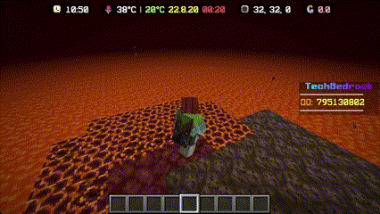

# 玩法总览

## 🌱 种植机制 🌱

由于插件的大幅调整，我们的种植机制有了以下新特点：

- 农田需要**温室玻璃**覆盖
- 需要**稻草人**看守农田，以确保作物的安全
- 为农田提供适当的水分，需要使用**洒水器**进行灌溉
- 我们还引入了多种新的植物，例如：**大蒜**和**葡萄**

---

## 🌟 附魔插件 🌟

在原版 Minecraft 的基础上，我们加入了许多新的附魔效果：

- **火焰行者**：让你可以在岩浆上自由行走
{width="700"}
- **矿透**：在短时间内查看周围的珍稀矿物
{width="700"}
- 弓可以附魔以**发射火球**
- 杀死敌人时，你有概率**获得其头颅**
- 等等......

---

## 🏰 城镇系统 🏰

和平共处，共同建设你的城镇！

- 建立你的城镇，进行个性化装饰
- 邀请好友加入你的城镇，共同开展活动
- 设定税收、设置城镇的土地边界，并购买更多的领地扩张你的城镇
- 创建国家，将多个城镇联合起来，和平共处
- 为你的城镇和国家设置法规、职责以及禁令

---

## 💰 交易系统 💰

为了让交易更加便捷和有趣，我们增设了：

- **拍卖行**：在这里，玩家可以竞拍物品，找到稀有的宝贝
- **方块商店**：购买和出售游戏中的各种方块

!!! tip "🔔 温馨提示 🔔"

    这些内容都只是一部分内容，举个例子，各个玩法的详细内容会在后面几节介绍

请玩家们在游戏中尽情探索以上内容，如有疑问或建议，请随时与我们取得联系！
