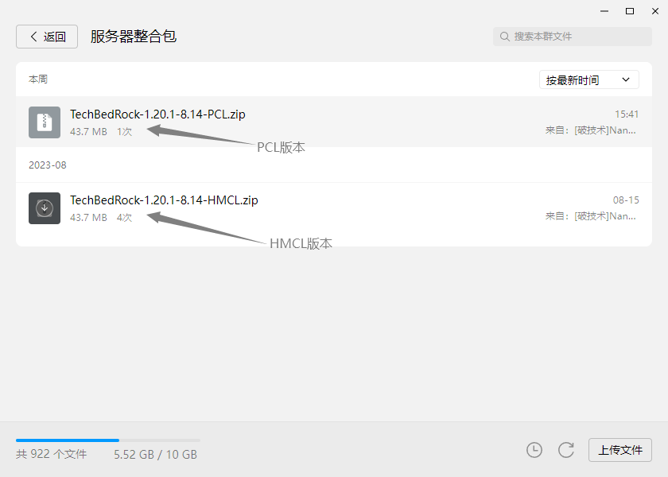

# 🚀 进服教程 (Tutorial) 🚀

## 服务器整合包安装

想要更流畅地体验 Minecraft 和 TechBedrock 服务器？这里有一个专为您定制的性能优化整合包，助您解决电脑配置不足的问题✨

---
```
## 🎮 整合包 MOD 列表 🎮

### 前置

- BookSelf
- fabric-api
- fabric-language-kotlin
- libIPN
- malilib
- cloth-config
- architectury

### 性能优化

- 钠|sodium
- 铟|indium
- 锂|lithium
- Iris

### 辅助

- JEI物品管理器|Jei
- 一键背包整理Next|InventoryProfilesNext
- 更好的F3|BetterF3

...更多MOD（南瓜懒得写了(bushi 😜)
```
---

💡 **小贴士**：使用 "钠"、"铟"、"锂" 和 "Iris" 这一性能优化组合，搭配其他优化 mod，将大大提升您的游戏体验！

---

## 📖 安装教程 📖

### 1. 下载整合包

- 打开QQ，搜索并加入我们的官方群
- 点击"文件"，进入"服务器整合包"文件夹
- 在文件列表中，找并下载名为 `TechBedRock-{版本}-{时间}-{启动器名称}` 的最新ZIP文件

### 2. 文件操作

- 下载完成后，定位到文件
- 为了便于操作，建议将文件移动到桌面

### 3. 使用PCL II导入整合包

- 启动PCL II启动器
- 在主界面，选择版本的下拉菜单 -> "导入整合包"

- 选择桌面上的整合包文件，点击"确定"

- 稍等片刻，系统将自动完成导入与设置...
---
