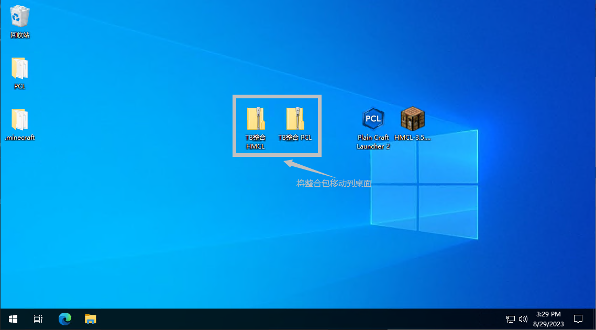
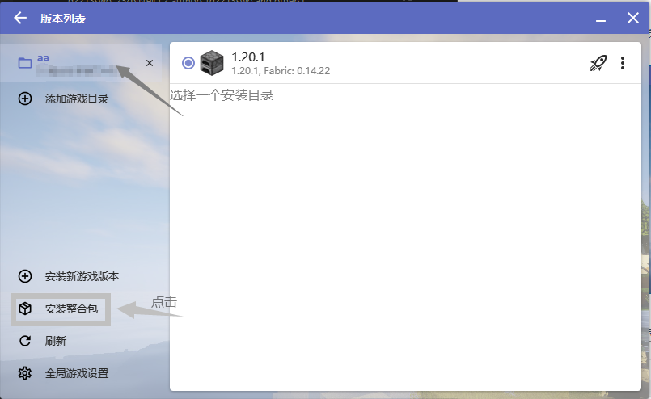

# 🚀 进服教程 (Tutorial) 🚀

## 服务器整合包信息

想要更流畅地体验 Minecraft 和 TechBedrock 服务器？这里有一个专为您定制的性能优化整合包，助您解决电脑配置不足的问题✨

---

```markdown
## 🎮 整合包 MOD 列表 🎮

### 前置

- BookSelf
- fabric-api
- fabric-language-kotlin
- libIPN
- malilib
- cloth-config
- architectury

### 性能优化

- 钠|sodium
- 铟|indium
- 锂|lithium
- Iris

### 辅助

- JEI物品管理器|Jei
- 一键背包整理Next|InventoryProfilesNext
- 更好的F3|BetterF3

...更多MOD（南瓜懒得写了(bushi 😜)
```

!!! tip "💡 **小贴士**"
    使用 "钠"、"铟"、"锂" 和 "Iris" 这一性能优化组合，搭配其他优化 mod，将大大提升您的游戏体验！

## 📖 安装教程 📖

### 1. 下载整合包

- 打开QQ，搜索并加入我们的官方群或者点击[这里](http://qm.qq.com/cgi-bin/qm/qr?_wv=1027&k=AOzvhL2XbSraeukv55rbIYN8dnoFR170&authKey=h730CW7B%2FyfvL8a28ke%2BzhshfkgxWyxKwgFxTv42uXN7xRoAtYcQkWSK2ujLvnIh&noverify=0&group_code=795130802)加入
- 点击"文件"，进入"服务器整合包"文件夹
- 在文件列表中，找并下载名为 `TechBedRock-{版本}-{时间}-{启动器名称}` 的最新ZIP文件

{width="700"}

### 2. 文件操作

- 下载完成后，定位到文件
- 为了便于操作，建议将文件移动到桌面
{width="700"}

### 3. **使用PCL II导入整合包**

- 启动PCL II启动器
- 在主界面，点击版本选择 -> 选择一个你安装游戏的目录 -> 再点"导入整合包"
{width="700"}
- 选择桌面上的整合包文件，点击"确定"  
{width="700"}
- 稍等片刻，系统将自动完成导入与设置...

### 4. **使用HMCL导入整合包**

- 启动HMCL启动器
- 在主界面，点击版本列表 -> 选择一个安装目录 -> 再点"安装整合包" -> "导入本地整合包文件>"
{width="700"}
{width="700"}
- 选择桌面上的整合包文件，点击"确定"
{width="700"}
- 稍等片刻，系统将自动完成导入与设置...

### 5. **启动游戏**

- 首先，你得有一个正版账号，不然进不了服务器。
{width="700"}
{width="700"}

!!! danger "👉 **正版购买指南** 👈"
    指南视频:
    [BiliBili](https://www.bilibili.com/video/BV1vo4y1b7J2/?spm_id_from=333.337.search-card.all.click&vd_source=c662b9c2590c1986da8372ac1909a3d1)<br>
    **请不要在官网购买，因某些特殊原因官网已关闭购买渠道**
